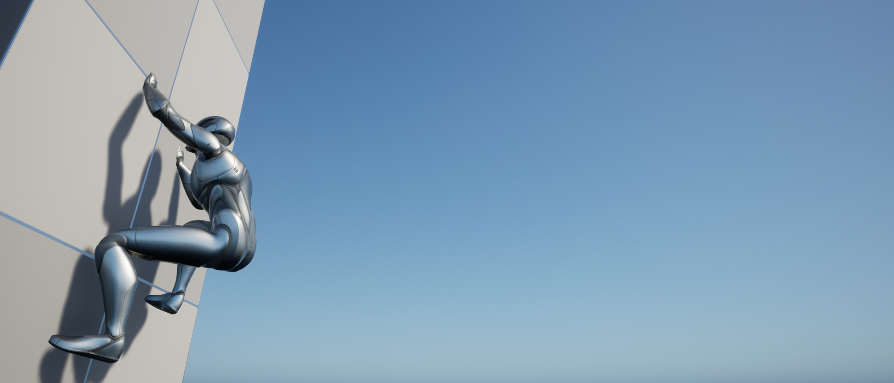

<h2 align="center">Unreal Engine 5 - C++ Sandbox </h2>

This project is meant to experiment with different gameplay features in C++.

 
Current Features:
<ul>  
  <li> Custom <b>UCharacterMovementComponent</b> that supports grounded third person movement, jumping, and climbing. </li>
  <li> Custom <b>APlayerCameraManager</b> that supports third person orbital camera (similar to games like Elden Ring and WoW). </li>
  <li> Custom <b>APlayerController</b> that handles input and logic for player character and camera. </li>
</ul>
